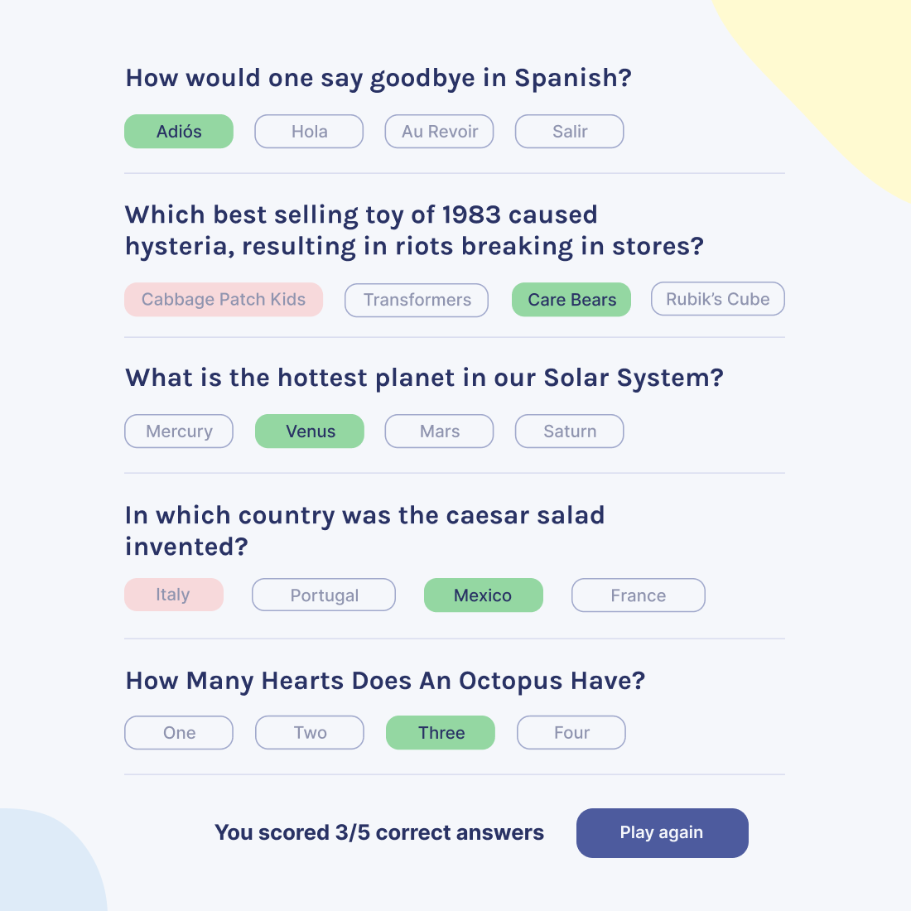

# quizzical
Solo and final project from Scrimbas' <a href="https://scrimba.com/learn/learnreact" target="_blank"><b>Learn React for free</b></a> course - A quiz app, data used retrieved from <a href="https://opentdb.com/api_config.php" target="_blank">OTDB API</a>

<a href="https://www.figma.com/file/6guWTOHY8N2i0NZHjcmRDK/Quizzical-App-(Copy)" target="_blank">Figma file(s)</a> copied of the design provided in the course by Scrimba.

## Stack:
  - React (v.18.0.14) with TS templates (TypeScript (v4.7.4))
  - React Router Dom (v6.3.0)
  - SASS (v1.53.0)
  - Axios (0.27.2)

Description:
1. Two screens:

   - Intro page: 
   

   - Questions page:  
   
    

2. Pull 5 questions from the [OTDB API](https://opentdb.com/api_config.php)

3. Show correct answers after the 'Check answers' button is clicked:  
   - Results page (with correct and incorrect answers + score):  
    